# Brier Score Plots

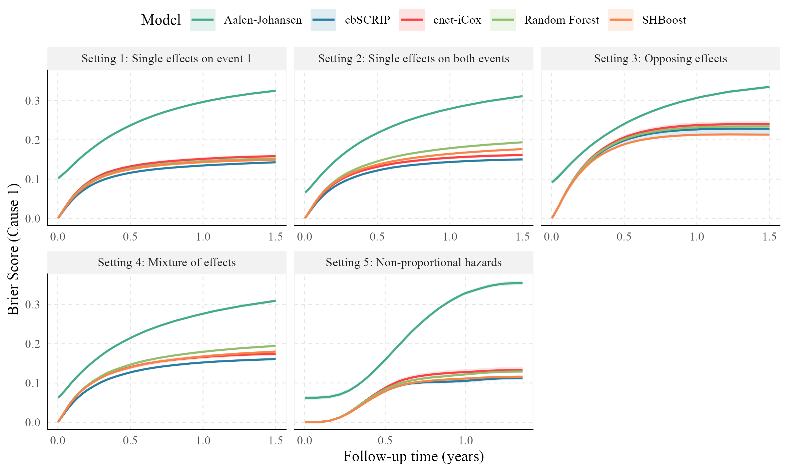{width=100%}

\newpage

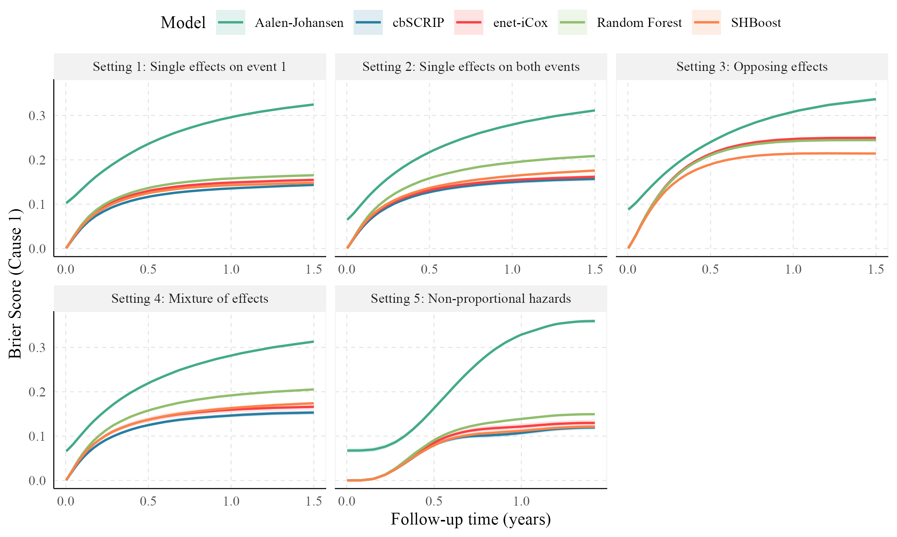{width=100%}

\newpage

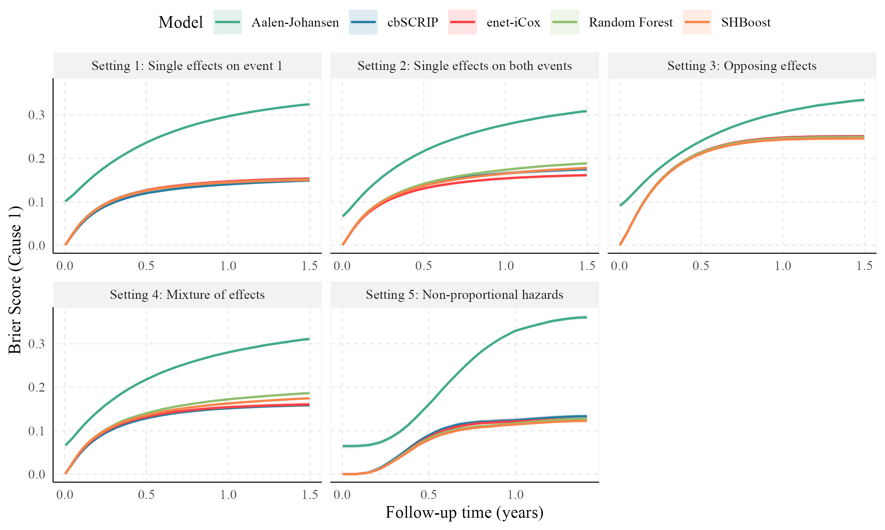{width=100%}

\newpage

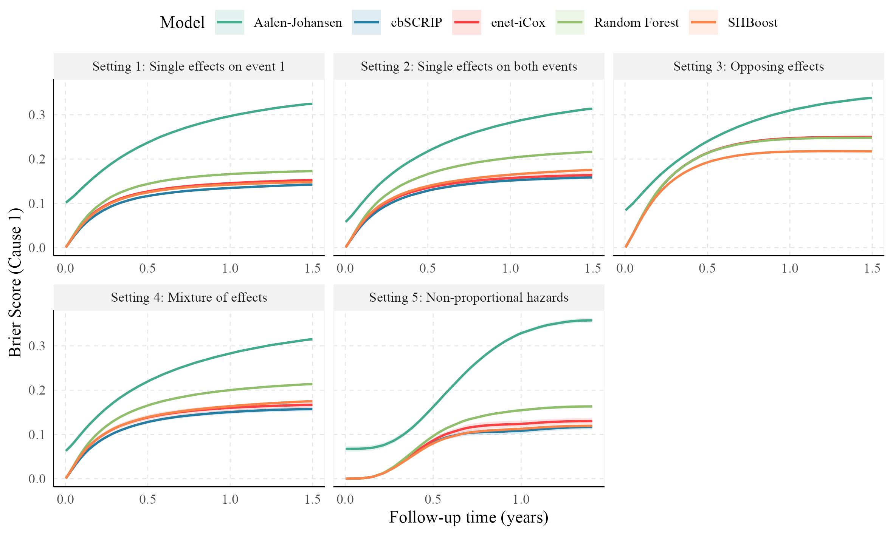{width=100%}

\newpage

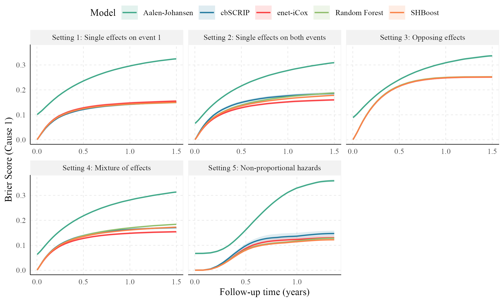{width=100%}

\newpage

# CIF Plots

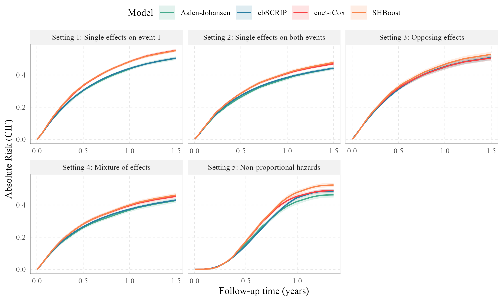{width=100%}

\newpage

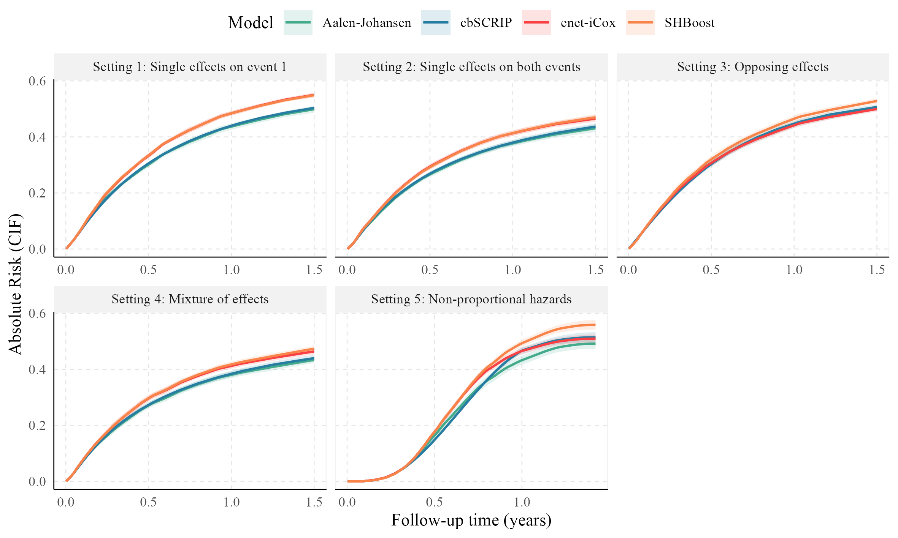{width=100%}

\newpage

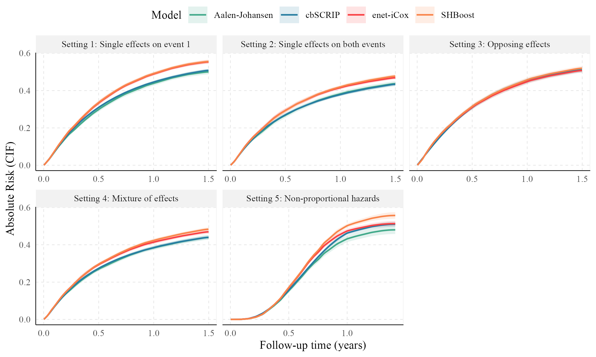{width=100%}

\newpage

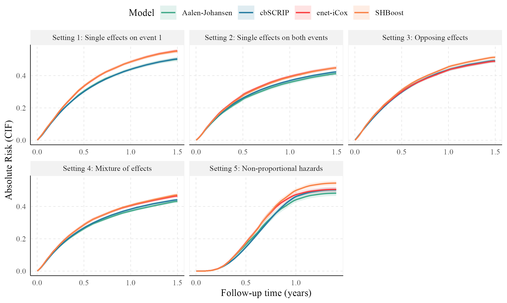{width=100%}

\newpage

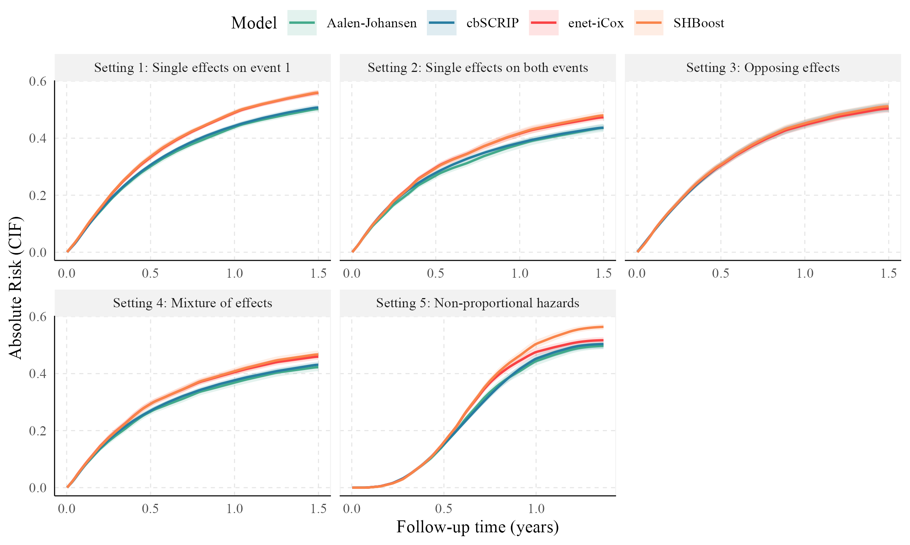{width=100%}

\newpage

# Time-dependent AUC Plots

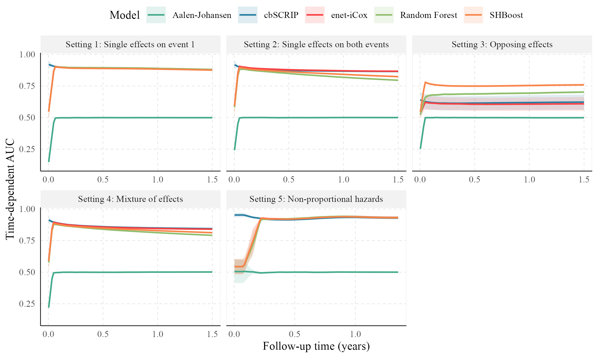{width=100%}

\newpage

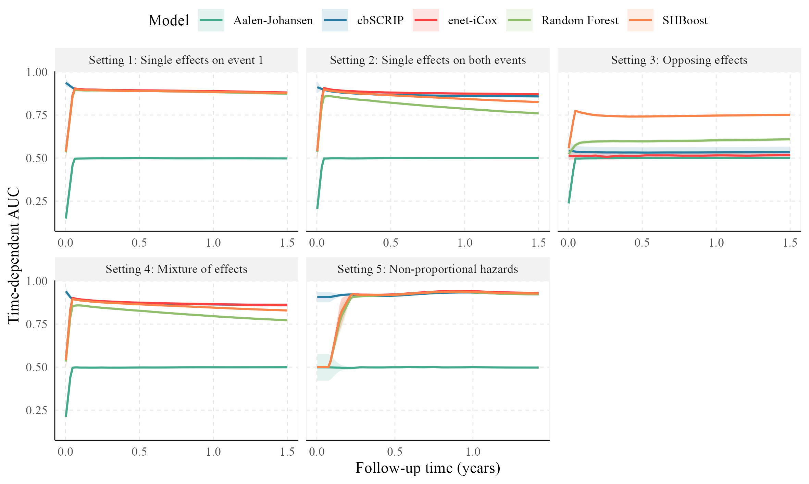{width=100%}

\newpage

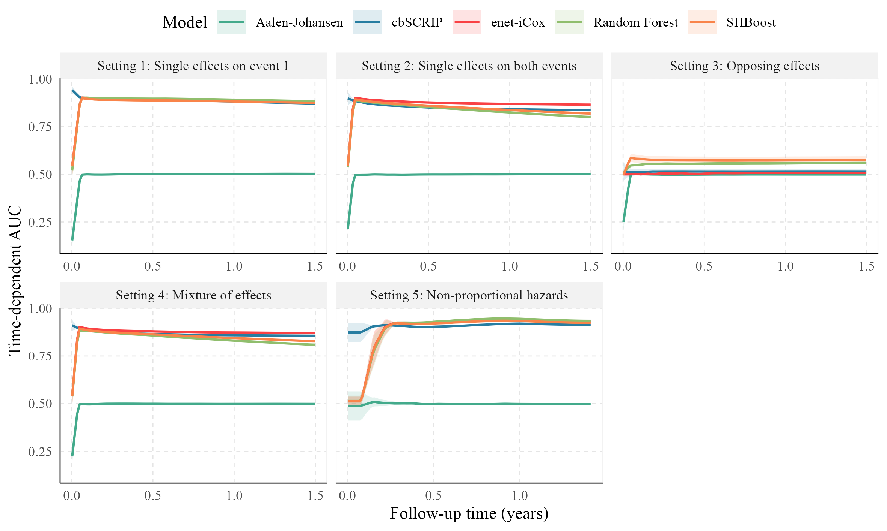{width=100%}

\newpage

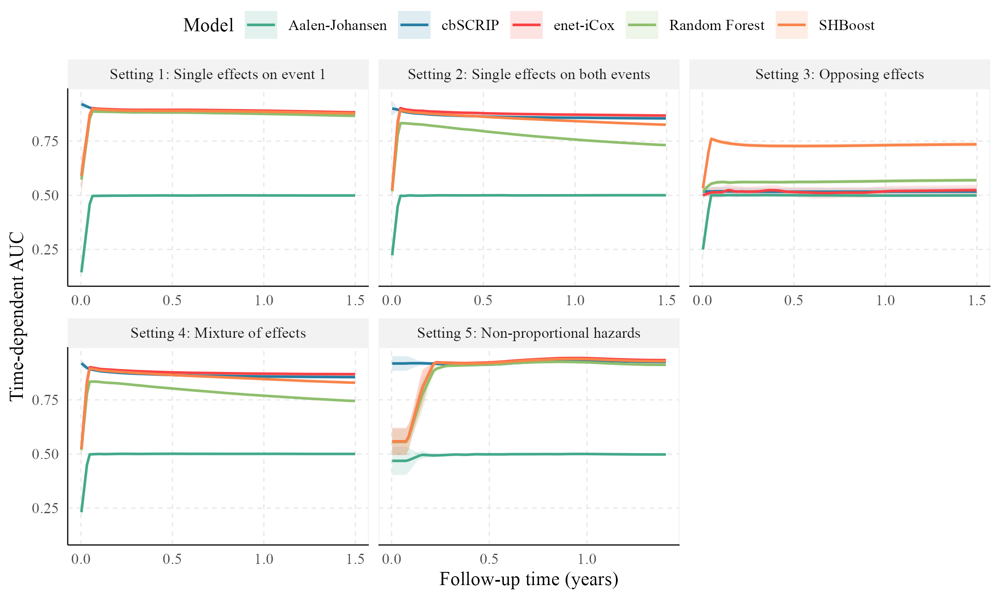{width=100%}

\newpage

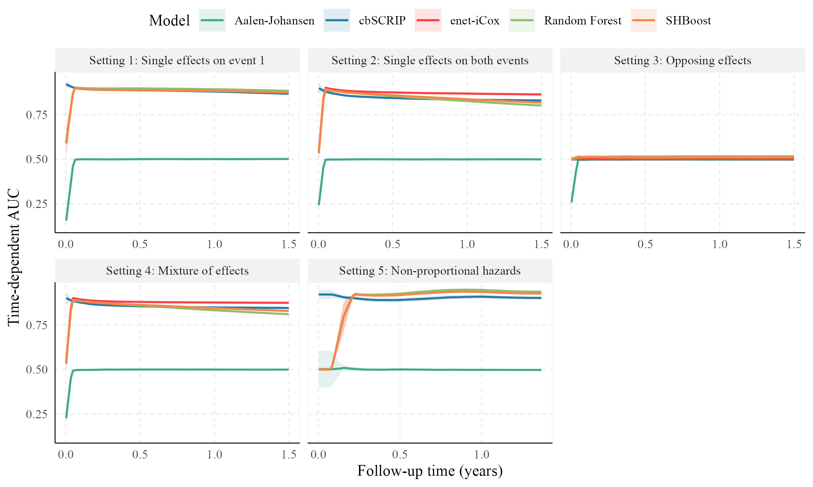{width=100%}
